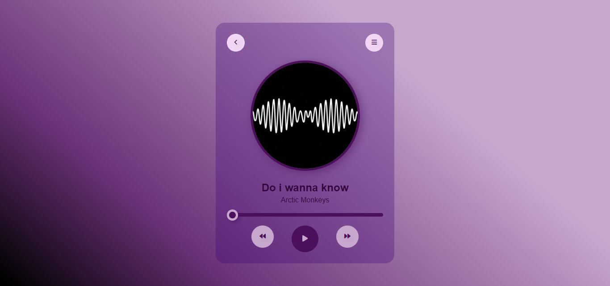

# Music Player

This is a simple music player built with HTML, CSS, and JavaScript.

## Features

- Play/Pause functionality
- Display of song details
- Navigation controls

## Progress

The project is still in progress. The current version includes the basic structure and styling of the music player. The JavaScript for controlling the music player is yet to be completed.

## Usage

A link to the live version of the music player will be provided once it's ready.

## screenshot

